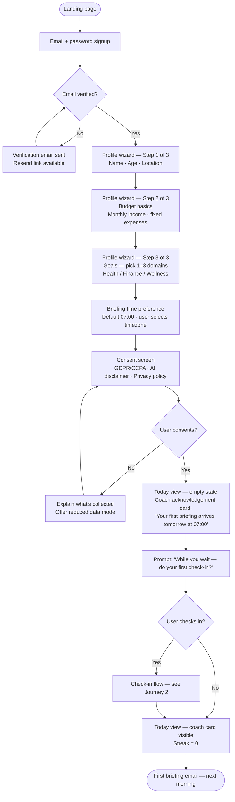
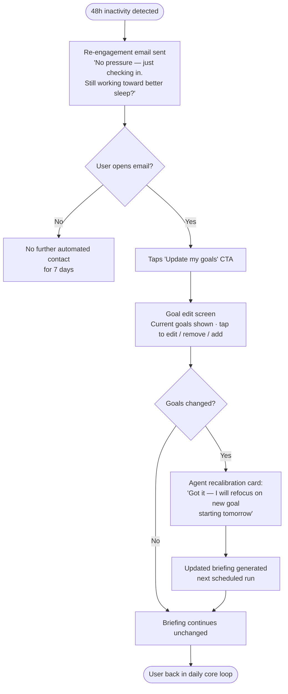

# UX Design Specification — LifePilot

**Author:** Ljuppa
**Date:** 2026-05-14

---

<!-- UX design content will be appended sequentially through collaborative workflow steps -->

## Executive Summary

### Project Vision

LifePilot is a cross-domain AI life agent — not a single-domain wellness tracker or inbox manager, but a proactive daily partner that connects health, finance, mental wellness, and travel goals into a coherent, personalised direction for the day.

**The north star metaphor: the user has hired a personal life coach.**

Not a dashboard. Not a digest. A relationship that compounds over time — one that remembers what was said three weeks ago, notices patterns the user hasn't spotted yet, and arrives every morning with something specific to say before the user has even framed a question. The defining felt experience is: *"this thing actually knows me."*

The core product delivery is a **daily AI briefing delivered by email** — compiled overnight, ready before the user wakes up. The web app is the configuration layer, the check-in surface, and the place where the relationship becomes visible over time. Email IS the product. The app is the coaching notebook.

### Target Users

**Primary persona:** Adults (25–45) who have goals across multiple life domains but find managing them in separate apps fragmented and exhausting. They are moderately tech-savvy, motivated but time-constrained, and want guidance rather than raw data. They are willing to share personal context (body stats, budget, location, goals) in exchange for genuinely personalised daily direction.

**Behavioural signal:** They have tried self-improvement apps before and abandoned them — not because the apps were bad, but because the apps never felt like they were paying attention. A streak tracker is not a coach. A dashboard is not accountability.

**Key emotional job-to-be-done:** *I want to feel like someone has been paying attention to my life — even on the days I haven't been.*

**Device context:** Email-primary means the morning briefing is consumed on mobile (inbox, before the day begins). The web app is used on desktop/laptop for setup, deeper review, and goal management. Check-ins are mobile-first and must complete in under 90 seconds.

### Competitive Position

Three closest competitors confirmed in market research (May 2026):

| Competitor | What they do right | What they miss |
|---|---|---|
| **Google Health Coach** ($9.99/mo, launched May 19) | AI coaching, health data depth, Gemini-powered | Health only, no email briefing, no narrative arc, no cross-domain |
| **alfred_** ($24.99/mo) | Proven email daily briefing model, inbox synthesis | Work/inbox only, no life coaching, no memory arc |
| **Gigi** (Sintra AI) | Personal growth framing, learns your context | Reactive (you pull it), no cross-domain proactivity, no daily push |

**White space LifePilot owns:** No current app combines proactive daily email briefing + cross-domain intelligence + a building relationship arc that feels like hiring a personal life coach. This position is confirmed unoccupied.

### Three Non-Negotiable UX Principles

These principles define LifePilot's differentiation. Violate any one and the product collapses into something a competitor already is.

---

**Principle 1 — Continuity over Completeness**

The system must remember more than the user does. Every interaction deposits into a persistent life model. The briefing references something from six weeks ago. The weekly summary surfaces a pattern the user hadn't articulated. Memory must be *visible* — not hidden in a backend model, but expressed in the coach's voice in a "what I know about you" living document the user can read and correct.

Concrete rule: every weekly summary must contain at least one new observation not present the week before. Memory must grow visibly or it might as well not exist.

*Without this: LifePilot is a prettier Gigi.*

---

**Principle 2 — Proactive Voice, Not Reactive Surface**

The coach arrives first. The daily briefing is ready before the user opens their phone. It contains something specific — not a template, not a generic insight, but a sentence that proves the system was watching. The opening lines of every briefing must be personalised prose, not a bulleted list of metrics.

Concrete rule: no bullet lists in the opening 200 words of the briefing email. No metrics above the fold. If the opening paragraph could have been sent to any user, it failed.

*Without this: LifePilot is a lifestyle-expanded Google Health Coach.*

---

**Principle 3 — Earned Friction**

A real coach does not only affirm. LifePilot must have a designed pattern for gentle, well-timed challenge — a distinct "coach's observation" message type, sent at most once a week, never in the morning briefing, always framed as curiosity not correction. This is the interaction that makes users feel genuinely held accountable, and it is the hardest to protect from being optimised away in design reviews.

Concrete rule: the "coach's observation" is a distinct message type with its own visual treatment and copy pattern. It asks one open question. It has no CTA. If this pattern doesn't exist in the shipped product, LifePilot is an affirmation machine — and affirmation machines get deleted in week three.

*Without this: LifePilot is an expensive alfred_ with lifestyle themes.*

### Key Design Challenges

1. **Onboarding as first coaching session, not setup wizard** — The user must feel heard before they feel configured. The first experience is conversational discovery ("what's the one area of your life you wish felt different right now?"), not a multi-step form. Value must be demonstrated — via a sample briefing — before the user has finished configuring.

2. **Email-primary product with app-secondary experience** — The daily briefing lands in the inbox, not the app. The web app is the coaching notebook and check-in surface. Both surfaces must have an emotional handshake — a user who opens the app after their first briefing must feel continuity, not hollowness.

3. **First-week briefings are the highest-risk UX moments** — The first three briefings, before habits are logged and preferences are calibrated, determine whether the user believes LifePilot knows them. These must be designed explicitly, not generated generically.

4. **Narrative arc as a first-class design element** — The app needs a "Your Journey" view: milestones phrased like chapters ("The month you started protecting your mornings"), not a graph of metrics. The user should be able to read their own biography in this product.

5. **AI compliance without destroying trust** — The EU AI Act requires a non-dismissible disclosure on all LLM content. The design challenge is to make this feel like a point of pride ("this recommendation was generated by AI, here's what it considered") rather than a legal warning label.

6. **Check-in as debrief, not form** — Multi-domain check-ins must complete in under 90 seconds and feel like a short session with the coach, not a data entry task. Post-check-in micro-feedback ("Got it — I'll adjust tomorrow's briefing") is the moment that makes logging feel worth doing.

7. **Day 30–90 retention** — The experience must be designed equally for sustained engagement, not just activation. Goal drift handling (the AI notices declining engagement and prompts a "still heading to Bali?" refresh) and monthly narrative summaries ("your story so far") are the primary retention mechanisms.

### Design Opportunities

1. **Progressive domain unlocking** — Start with the user's single stated priority domain. Deliver an impressive first briefing fast. Then gradually invite more domains. Value before commitment.

2. **Cross-goal visual connection** — A simple contextual note on each briefing recommendation showing how one action serves multiple goals: *"this one move advances 3 of your goals."* Not icon tags — a sentence in the coach's voice.

3. **Visible memory as trust engine** — A "what I know about you" section in the app, written in the coach's voice, that the user can read and correct. When memory is legible, the user stops wondering if the AI knows them and starts feeling that it does.

4. **Monthly narrative summary** — A "Your Story So Far" email — narrative arc across health, finance, and wellbeing that the user can feel proud of. Not a report. Evidence that the investment in this relationship is paying off.

5. **Graceful goal drift handling** — When the AI notices declining engagement in a domain, it prompts a low-friction goal refresh ("hey, still heading to Bali?") — a retention lever and data quality mechanism in one.

## Core User Experience

### Defining Experience

The primary experience of LifePilot is not using an app — it is **receiving a letter**.

Every morning, before the user has made a single decision, LifePilot has already done its thinking. The daily briefing arrives in the inbox like a note from someone who has been paying attention overnight. It takes two minutes to read. It tells the user what matters today, why it matters across their goals, and what one action would move things forward. Then it gets out of the way.

Everything else in the product — the onboarding, the check-in, the goal tracking, the web app — exists to make that letter better tomorrow than it was today.

**The core loop:**
```
Check in (90 seconds) → AI thinks overnight → Briefing arrives (2 min read) → User acts → repeat
```

This loop compounds. At week one, the briefing is good. At month three, it is specific to a degree that feels almost uncanny — because it has been accumulating context from every check-in, every goal update, every moment the user said "actually, that changed."

### Platform Strategy

**Email — primary product surface (briefing delivery):**
- Daily briefing delivered at a user-configured time (default 07:00 local)
- Consumed on mobile, in the inbox, before the day begins
- Plain-text-first with minimal HTML styling — reads like a letter, not a newsletter
- Single scroll — no sections, no headers above the fold — opening paragraph is always personalised prose

**Web app — the coaching notebook (setup, check-in, history):**
- Responsive web, mobile-first layout for check-in flow
- Desktop-optimised for onboarding (profile setup, goal configuration) and history review
- No native iOS app in MVP — web app installable as PWA for mobile home screen access
- Offline check-in: form works offline, syncs when connected (critical for travel and gym scenarios)

**No push notifications in MVP:**
- The coach arrives by email. Push notifications undermine the "letter" metaphor and create the same anxiety as every other app. Notification strategy deferred to Phase 2.

### Effortless Interactions

**What must require zero thought:**

1. **Opening the morning email** — subject line format is always consistent: *"Your Thursday — [one-line preview of the day's focus]"*. Open rate depends on this being Pavlovian.

2. **Completing the daily check-in** — single scrollable screen, sliders and quick-pick chips, no free text required (optional). Opens with a single sentence acknowledging the previous briefing: *"Yesterday I suggested a walk — did it happen?"* Completes in under 90 seconds. No back button needed. No "page 2 of 3."

3. **The briefing email layout** — one primary suggestion is visually prominent. Everything else is supporting context. One tap from email to the web app to log a check-in.

4. **Goal setup** — not a form, a conversation. Single question per screen. The AI synthesises answers into a structured goal; the user confirms or adjusts. Never asks for data it can infer.

**What happens automatically (zero user effort):**
- Briefing generated overnight — no user trigger required
- Streak computation and inactivity detection
- Retention of context across briefings — the AI remembers, the user doesn't have to re-state
- Monthly narrative summary generated and emailed on the first of each month

### Critical Success Moments

**Moment 1 — The First Sentence of Briefing #1**
The make-or-break moment of the entire product. The very first line of the very first briefing must prove the AI was paying attention during onboarding. If it reads as generic, the user will not open briefing #2. This is not a template — it is a bespoke sentence referencing something specific the user said. Design and test this sentence before any other UI.

**Moment 2 — The First Cross-Domain Connection**
The first time the briefing links two domains the user listed separately — *"the walk I'm suggesting today is also the cheapest way to clear your head before the budget review you mentioned"* — is the moment the user understands what LifePilot actually is. Must arrive within the first week.

**Moment 3 — The Coach's First Pushback**
The first "coach's observation" message — when LifePilot gently names a pattern the user hadn't seen — is the moment trust either deepens or breaks. The copy for this message type is among the most important copy in the product. It must feel like a gift, not a gotcha.

**Moment 4 — Week 4 Recognition**
When the user reads a briefing in week four and it feels meaningfully more specific than week one — this is when the relationship becomes real. A subtle "I've been noticing..." opening, referencing the arc of the past month, delivers this moment explicitly.

**Moment 5 — The Check-In Acknowledgement**
The 2-second micro-response after every check-in submission: *"Got it — I'll adjust tomorrow's briefing."* This is a promise, not a confirmation toast. The copy must feel like the coach heard you. This single line is responsible for whether users check in tomorrow.

### Experience Principles

1. **The coach speaks first.** Every primary interaction begins with the system's voice, not the user's. The briefing arrives before the user opens the app. The check-in opens with the coach's acknowledgement before asking for data. Onboarding begins with a question, not a form.

2. **Memory is the product.** Every feature that does not contribute to the system knowing the user better over time is a distraction. The briefing quality at month three is the product promise. Every design decision is evaluated against whether it improves that promise.

3. **Two minutes, then done.** The core daily interaction — reading the briefing — must be completable in two minutes. The check-in in 90 seconds. If a screen or email requires more time or cognition than this, it is too complex. Comprehensiveness is the enemy of habit.

4. **Friction earns trust.** Occasional gentle friction — the coach's observation, the check-in question that probes a contradiction — is not a usability failure. It is the mechanism that makes accountability real. Design for productive discomfort, not just satisfaction.

5. **Visible growth, felt progress.** The user must be able to see that the relationship is building. Weekly and monthly summaries surface the arc explicitly. The "what I know about you" section in the app grows visibly. Progress is felt, not just tracked.

## Desired Emotional Response

### Primary Emotional Goals

**The defining feeling: "This knows me."**

Not impressed by technology. Not satisfied by usefulness. *Known.* The felt sense that an intelligence has been paying specific attention to this particular person's life — not a user profile, not a persona, but *them*. This is the emotion that no competitor currently delivers, and it is the one that converts a user into an advocate.

**Supporting feelings, in order of importance:**

1. **Calm orientation** — starting each day with direction rather than anxiety. Not motivated (motivation is unstable), not productive (that's a side effect) — simply *oriented*. "I know what matters today."
2. **Felt accountability** — the quiet sense that someone is tracking the arc of your commitments, even on the days you aren't. Not guilt. Accountability with warmth.
3. **Earned pride** — at milestones, at the monthly summary, at the moment the briefing references something from six weeks ago that the user had forgotten they'd shared.
4. **Productive discomfort** — the brief, welcome friction of the coach's observation. The feeling of being seen in a way that is slightly uncomfortable and ultimately grateful.

### Emotional Journey Mapping

| Moment | Desired emotion | What creates it |
|---|---|---|
| First visit / discovery | Intrigued, hopeful | Clear product promise — "a personal life coach, not another tracker" |
| Onboarding intake session | Slightly vulnerable, then safe | Conversational tone, one question at a time, no form aesthetic |
| Waiting for first briefing | Anticipation | "Your first briefing arrives tomorrow morning" — the wait is part of the experience |
| Opening first briefing | Surprised by specificity | First sentence references something they said specifically during onboarding |
| First cross-domain connection | "Oh — it actually gets it" | A sentence linking two goals they listed separately, in one recommendation |
| Daily check-in | Heard | Micro-acknowledgement opens the form; "Got it — I'll adjust tomorrow's briefing" closes it |
| The coach's first observation | Productively uncomfortable, then grateful | Curiosity framing ("I'm just noticing…"), no CTA, open question |
| Week 4 briefing | Trusted | Briefing references the arc of the past month — "I've been noticing…" |
| Monthly narrative summary | Proud and reflective | Chapter-style milestones, coach's voice, no metrics |
| Goal achieved | Celebrated, then redirected | Briefing marks the moment warmly, then asks "what's next?" — the coach doesn't let you drift |
| Days of low engagement | Gently held, not judged | Coach reaches out with curiosity, not a streak counter |

### Micro-Emotions

**Confidence over confusion** — Every screen and every email must have one clear primary action. If the user pauses to wonder what to do next, confusion has been introduced. The coach always tells you what to do today.

**Trust over scepticism** — Built through consistency (briefing always arrives at the same time), specificity (always references the user's actual life), and visible memory (user can see what the AI knows about them). Trust is not claimed — it is demonstrated over time.

**Delight over mere satisfaction** — Satisfaction means the product did what was expected. Delight means it did something unexpected that the user immediately recognised as right. The cross-domain connection in week one is delight. The monthly narrative summary is delight. Design for moments that earn a "how did it know that?"

**Accountability over guilt** — Guilt says "you failed." Accountability says "I noticed — what happened?" The tone of every nudge, every coach's observation, every re-engagement message must land as the latter. Guilt closes people down. Accountability opens them up.

**Belonging over isolation** — LifePilot's voice carries genuine partnership — a coach invested in the outcome. Avoid the cold clinical distance of a dashboard. Avoid the hollow cheerfulness of a gamified app. Warm, considered, invested.

### Emotions to Actively Avoid

| Emotion | What triggers it | How to prevent it |
|---|---|---|
| **Managed / surveilled** | Over-frequent nudges, data-forward UI, metrics on every screen | Limit proactive contact to one briefing + one check-in per day; hide raw metrics behind "view details" |
| **Overwhelmed** | Long briefings, multiple CTAs, complex onboarding | Two-minute briefing cap; single primary action per email; one question per onboarding screen |
| **Judged** | Accusatory language on missed goals, streak-shame patterns | Never surface a broken streak without a compassionate reframe; coach's observations are always curious, never critical |
| **Generic** | Template-feeling briefings, same structure every day, no personal reference | Every briefing opening must pass the "could this have been sent to anyone?" test — if yes, rewrite |
| **Anxious** | Push notifications, badge counts, urgency language | No push notifications in MVP; no "you're falling behind" framing; briefing tone is calm and orienting |

### Design Implications

**"Known"** → Personalised prose openings in every briefing. Visible memory in the "what I know about you" section. AI references prior check-in content unprompted. Onboarding conversation remembered verbatim in early briefings.

**"Calm orientation"** → Briefing opens with one grounding sentence about today, not a list of everything due. Subject line previews the day's single focus. No metrics, charts, or scores in the email.

**"Felt accountability"** → Coach's observation as a distinct, designed interaction pattern. Re-engagement messages framed as curiosity, not failure notices. Monthly arc visible in narrative summary.

**"Earned pride"** → Monthly "Your Story So Far" email in chapter format. Goal completion acknowledged warmly before redirecting to what's next. Week 4 briefing explicitly marks the depth of the relationship.

**"Productive discomfort"** → Coach's observation has its own visual treatment — softer, quieter than a briefing. One open question, no CTA. Sent mid-week, never Monday morning.

### Emotional Design Principles

1. **Warm authority, not cheerful servility.** LifePilot's voice is confident and caring — a coach who knows you well enough to say the thing you needed to hear. Never sycophantic. Never corporate. The tone earns trust by occasionally saying something difficult.

2. **Surprise through specificity, not novelty.** Moments of delight come from the AI proving it remembers, not from clever animations or unusual UI patterns. Every interaction that makes the user feel known is worth more than any visual flourish.

3. **Emotional continuity across surfaces.** The email and the web app must feel like the same coach speaking. Voice, warmth, level of specificity — continuous and consistent. If the email feels personal and the app feels like a SaaS dashboard, the relationship breaks.

4. **Protect the emotional tempo.** One briefing per day. One check-in per day. One coach's observation per week. Emotional resonance requires space. Over-contact creates anxiety. The coach who emails seven times a day is not a coach — it is a notification.

5. **Celebrate the arc, not just the milestone.** A goal completed is good. But "three months ago you said you'd never stick to a budget — look at March" is great. Design for moments that let users see themselves across time, not just at the finish line.

## UX Pattern Analysis & Inspiration

### Inspiring Products Analysis

Three products are directly instructive for LifePilot — each owns a different dimension of the experience we need to build.

---

**1. Superhuman — the email that feels like a product**

Superhuman redefined what a premium email experience could feel like. It is opinionated, fast, and deliberately limited in what it shows. The insight: email can be the product surface, not just the delivery channel. Users pay $30/month for an email client because it makes them feel in control before the day starts.

What Superhuman does right:
- **Signal over noise by default** — the inbox shows only what requires attention; everything else is invisible until asked for
- **Speed as a trust signal** — instant response, no loading states. Speed communicates that the product respects your time
- **Consistent interaction patterns** — the same gesture archives, replies, or triages across every context. Users build muscle memory in days
- **The "Inbox Zero" emotional payoff** — a single interaction clears the cognitive load of the morning. The satisfaction is designed in, not accidental
- **Onboarding as personal coaching** — Superhuman's onboarding is a 1-on-1 session. Users feel invested in before they've sent a single email

Relevance to LifePilot: the briefing email must feel as curated and intentional as a Superhuman inbox. One primary action. No noise. Opening it should feel like being briefed by someone who did the thinking for you.

---

**2. Calm — coaching voice at scale**

Calm built a billion-dollar product on a single insight: the right voice, at the right moment, changes how you feel. The app is less about features and more about tone — everything is designed to reduce anxiety, not add to it.

What Calm does right:
- **Voice-forward experience** — the human voice IS the product. The UI is a container for the voice, not the reverse. Warm, unhurried, never clinical
- **Session-based structure with clear entry/exit** — you open Calm, do a session, leave. No ambient use, no infinite scroll. The product respects finite attention
- **Compassionate non-judgement on missed streaks** — re-engagement copy is among the best in the industry. "We noticed you haven't been here in a while — that's okay, life happens." No shame
- **Consistent daily ritual anchoring** — the "Good morning" series creates a Pavlovian association between the app and the start of the day
- **Progressive depth without complexity** — deeper content comes to you; you don't have to navigate to it

Relevance to LifePilot: every piece of copy — every briefing line, every check-in acknowledgement, every re-engagement message — should feel closer to Calm's voice than to any SaaS app. The coach's observation pattern borrows directly from Calm's approach to re-engagement.

---

**3. Morning Brew — the email that reads like a letter**

Morning Brew proved that a daily email could become a non-negotiable morning ritual for millions — not through personalisation but through consistent personality, reliable format, and prose that feels like a smart friend talking to you over coffee.

What Morning Brew does right:
- **Pavlovian subject lines** — the format is so consistent that regular readers open without reading the subject. Habit is triggered by sender name alone
- **Opening with warmth before information** — every issue opens with 1-2 conversational sentences that set the emotional register before any content
- **Skimmable but readable** — respects both the 2-minute reader and the 20-minute reader. Neither feels punished
- **Consistent sign-off as relationship signal** — the closing line is always the same format. The reader knows when the letter is done
- **No dark patterns** — never guilt-trips on unsubscribes. The relationship is opt-in all the way through

Relevance to LifePilot: the daily briefing borrows Morning Brew's structural confidence — consistent subject line format, opening warmth before content, skimmable body with one primary action prominent, and a sign-off in the coach's voice. The difference: Morning Brew is identical for every reader; LifePilot's briefing must pass the "could this have been sent to anyone?" test with a clear no.

---

### Transferable UX Patterns

**Navigation Patterns:**
- **Single-focus screens** (Superhuman) → each screen has one primary action and one clear next step; no competing CTAs
- **Consistent entry point** (Calm) → check-in is always one tap from the dashboard; briefing history is secondary navigation, never the landing page
- **Bottom navigation for mobile** → Dashboard / Check-in / Goals / Profile — four tabs maximum, named by user intent not feature name

**Interaction Patterns:**
- **Swipe/gesture-to-complete** (Superhuman) → sliders and quick-picks resolve with a single gesture; no "save" button needed on check-in
- **Immediate micro-acknowledgement** (Calm session completion) → after check-in submit: *"Got it — I'll adjust tomorrow's briefing"* appears for 2 seconds, then returns to dashboard
- **Conversational single-question onboarding** (Typeform/Calm) → one question per screen, large text, soft background, progress indicator showing "step 2 of 6"

**Email Patterns:**
- **Consistent subject line format** (Morning Brew) → *"Your [Day] — [one-line focus preview]"* — same sender, same format, always. Pavlovian open habit builds in 2 weeks
- **Prose opening, structure below the fold** (Morning Brew) → first 3–4 sentences are personalised narrative; structured content follows
- **Single prominent CTA** → one button per briefing: "Log today's check-in." Everything else is text links

**Visual Patterns:**
- **Generous whitespace and large type** (Calm, Linear) → 18px minimum body text, ample line height, white or very light backgrounds. Signals calm, not urgency
- **Muted, warm colour palette** (Calm) → no primary-button red, no high-contrast alert colours in daily flow; one accent colour used only for primary action
- **Coach's observation visual distinction** → slightly different background (warm grey vs white), no header, slightly smaller type — visually quieter to signal "this is a different kind of message"

### Anti-Patterns to Avoid

| Anti-pattern | Why it fails for LifePilot |
|---|---|
| **Streak shaming** | Guilt closes users down. A broken streak should prompt curiosity, not a fire emoji counter reset |
| **Dashboard as landing page** | Metrics as home screen positions LifePilot as a tracker, not a coach. Landing state = today's briefing status |
| **Multi-step modal onboarding** | A 12-step wizard creates anxiety. One question, one screen, warm tone |
| **Cold empty states** | "You haven't set any goals yet — Add a goal →" is cold. LifePilot empty states are always in the coach's voice |
| **In-app notification centre** | Fragments attention and signals distrust of the primary channel (email). LifePilot communicates through the briefing or not at all |
| **Raw data tables in history** | A table of check-in metrics is the opposite of a coaching narrative. History = timeline of milestones and coach observations |
| **Unlimited scrolling briefing** | If the briefing takes more than 2 minutes, the habit breaks. Hard limit: 250 words maximum in the email body |

### Design Inspiration Strategy

**Adopt directly:**
- Superhuman's signal-over-noise discipline → one primary action per briefing, no competing elements
- Morning Brew's subject line consistency → same format every day, builds Pavlovian open habit
- Calm's re-engagement copy tone → curious and warm, never guilty or urgent
- Morning Brew's prose-first email opening → personalised narrative before any structured content

**Adapt for LifePilot:**
- Superhuman's personal onboarding → adapted to a conversational single-question in-product flow (same feeling of personal attention, no human call needed)
- Calm's session structure → adapted to the check-in: enter, answer 3–5 quick questions, receive acknowledgement, exit in under 90 seconds
- Morning Brew's consistent closing → adapted as the briefing sign-off in the coach's voice: *"That's your [Day], [Name]. Make it count."*

**Avoid entirely:**
- Duolingo's streak gamification — accountability through relationship, not through streaks
- Generic SaaS dashboard as home screen — briefing status is the home, not metrics
- Any in-app notification system — the briefing IS the notification

## Design System Foundation

### Design System Choice

**Tailwind CSS v3 + shadcn/ui** (Radix UI primitives) — a Themeable System providing a strong accessible component foundation, fully customisable through design tokens, AI-agent-friendly code generation, and zero vendor lock-in on component aesthetics.

### Rationale for Selection

1. **Accessibility built in** — shadcn/ui components are built on Radix UI primitives: keyboard navigation, ARIA attributes, focus management, and screen reader support are correct by default. WCAG 2.1 AA compliance from day one, preventing the most common AI-agent accessibility failure modes.

2. **Warm authority aesthetic is achievable** — shadcn/ui ships in neutral, understated style — not corporate blue, not playful app. The Calm-inspired palette (warm off-whites, muted sage accents, generous whitespace) maps directly onto shadcn/ui's CSS variable token system with minimal overrides.

3. **AI-agent implementation consistency** — shadcn/ui components are the most widely represented Next.js component patterns in AI training data. Agents generate correct, idiomatic usage first time. No extensive documentation required for consistent implementation.

4. **Owned code, not a dependency** — shadcn/ui copies component source into `components/ui/`. No breaking upgrades, no version drift. AI agents can read, understand, and safely extend the components.

5. **Solo builder constraints** — Fast enough for a solo builder, flexible enough for a distinctive product. The correct middle path between a custom design system (too slow) and an off-the-shelf system like MUI (fights the coach aesthetic).

### Implementation Approach

**Design tokens (CSS variables in `globals.css`):**
```css
--background: 40 30% 98%;          /* warm off-white */
--foreground: 220 15% 20%;         /* deep warm charcoal */
--primary: 152 35% 42%;            /* muted sage green */
--primary-foreground: 0 0% 100%;
--muted: 40 20% 94%;               /* light warm grey */
--muted-foreground: 220 10% 45%;
--accent: 35 80% 58%;              /* warm amber — used sparingly */
--coach-observation: 40 25% 92%;  /* distinct surface for coach's observation */

/* Typography scale */
--font-sans: 'Inter', system-ui;   /* UI chrome — navigation, labels, buttons */
--font-serif: 'Lora', Georgia;     /* briefing prose only — reinforces letter metaphor */
```

**Typography strategy:**
- **Inter** (sans-serif): all UI chrome — navigation, labels, buttons, metadata
- **Lora** (serif): briefing prose content only — when the user reads the briefing, it must feel physically different from an app interface

**Layout scale:**
- Body text: 18px mobile / 16px desktop — larger than standard SaaS, signals calm reading
- Line height: 1.7 — generous, editorial
- Max content width: 680px — letter-width layout for briefing view and check-in flow

### Customisation Strategy

**What stays default (never override):**
- Radix UI behaviour and ARIA attributes — accessibility primitives are untouchable
- `components/ui/` internal structure — regenerated on shadcn/ui upgrades

**What is customised via tokens:**
- Full colour palette — warm, muted, coach-aesthetic
- Border radius: `--radius: 0.75rem` — softer than default
- Shadows: very subtle, warm-tinted — `0 1px 3px hsl(40 20% 80% / 0.4)`

**Custom components built on top (`components/shared/`):**
- `CoachLetter` — briefing preview wrapper using Lora typography, 680px max-width, letter-like padding
- `CoachObservation` — distinct surface using `--coach-observation` background, no header, open-question copy pattern
- `CheckinSlider` — large touch target (44px minimum), single gesture, no save button
- `AiDisclosureWrapper` — non-dismissible footer on all LLM surfaces, muted styling, coach-voice copy
- `MilestoneChapter` — narrative milestone display for "Your Journey" view, chapter heading, warm accent border

**Email template styling (separate from web app):**
- Plain HTML with inline CSS — no Tailwind in email
- Matches web app token colours via hardcoded hex equivalents
- Lora for opening prose, system sans-serif for metadata
- Maximum width: 600px, single column, no images in MVP

## Defining Core Experience

### The Defining Experience

**"Open your morning letter and know exactly what to do today."**

LifePilot's defining interaction is a moment, not a feature. Every morning, an email arrives. The user opens it. In under two minutes, they feel oriented, seen, and clear on what matters today. Then they close it and get on with their day.

*"LifePilot? It's like having someone who knows your life write you a note every morning before you wake up."* — that is the friend-to-friend description we are designing toward.

### User Mental Model

**What is familiar:**
- Email as the medium — no new app to open, no new habit to form; co-opts an existing morning ritual
- A letter-like format — prose before structure, personal tone, clear ending
- A single daily touchpoint — not ambient, not always-on

**What is novel:**
- The AI knows them specifically — the opening sentence proves it immediately
- One email connects multiple life domains — a single recommendation serving health *and* finance *and* mental wellness simultaneously
- The coach relationship builds over time — briefing #30 is meaningfully different from briefing #1

**Where users currently get frustrated with similar products:**
- Generic recommendations that could have been sent to anyone
- Multiple apps that don't talk to each other — the fitness app doesn't know about the budget stress
- Products that require the user to initiate — another thing to remember to open
- Dashboards that show data without saying what to do with it

### Success Criteria

1. **The opening sentence passes the specificity test** — references something from the user's actual life that could not have been written for anyone else
2. **The cross-domain connection lands** — within the first week, the user reads a recommendation that links two goals they think of as separate
3. **The user acts on the suggestion** — orientation leads to behaviour change, not just consumption
4. **The user opens the next day's email** — daily open rate is the primary engagement metric
5. **The user tells someone** — word-of-mouth signals the product has crossed from useful to felt

### Novel vs. Established Patterns

**Established — email medium:** Zero learning curve. Users bring decades of email muscle memory. Leverage entirely.

**Novel — personalised AI letter:** Genuinely written around the user's specific context, goals, and recent check-ins. Requires one explicit teaching moment during onboarding: *"Every morning, I'll send you a personal briefing based on your goals and how yesterday went. It's written for you specifically — not a newsletter."*

**Novel — cross-domain connection:** Explained inside the first briefing itself, not as a tutorial. The briefing teaches the pattern by demonstrating it.

**Novel — coach's observation:** Requires careful framing on first appearance: *"I noticed something I wanted to share with you..."* — so users understand this is a distinct message type, not an error or alert.

### Experience Mechanics

**The Daily Briefing Email:**

| Phase | Detail |
|---|---|
| **Initiation** | Email arrives at configured time (default 07:00 local). Subject: *"Your Thursday — walk before the budget meeting"*. Sender name triggers open habit within 2 weeks. No push notification. |
| **Structure** | Opening sentence (personalised, specific) → Today's single focus → Cross-domain connection with multi-goal impact named explicitly → Supporting context (2–3 sentences referencing recent check-ins) → One CTA button ("Log today's check-in") → Sign-off (*"That's your Thursday, Ljuppa. Make it count."*) |
| **Length** | 180–250 words maximum. No exceptions. |
| **Feedback** | Specificity of the opening sentence IS the feedback. "It knows me" is felt in the first 10 seconds. |
| **Completion** | User closes the email. No required action. Briefing archived in web app under "Your Briefings." No follow-up prompt. |

**The Daily Check-In:**

| Phase | Detail |
|---|---|
| **Initiation** | Tap "Log today's check-in" from email CTA, or open web app directly. Available all day — not time-gated. |
| **Screen 1 (only screen)** | Opening acknowledgement referencing yesterday's suggestion → Mood slider (large touch target, warm 1–10 scale, no numerical labels) → 2–3 domain quick-checks based on active goals → Optional one-line open field |
| **Duration** | Under 90 seconds. Single scroll. No back button needed. No "page 2 of 3." |
| **Feedback** | On submit: *"Got it — I'll adjust tomorrow's briefing."* — 2 seconds, then dashboard. No streak surface, no score, no confetti. |
| **Completion** | Dashboard shows: *"Tomorrow's briefing: generating overnight."* The promise is the closure. |

## Visual Design Foundation

### Color System

**Palette philosophy:** Warm, muted, editorial — closer to a personal letter than a productivity app. Signals calm authority, not clinical efficiency.

| Token | HSL | Hex | Usage |
|---|---|---|---|
| `--background` | `40 30% 98%` | `#FAF9F6` | Page background — warm off-white |
| `--foreground` | `220 15% 20%` | `#2D3142` | Body text — deep warm charcoal |
| `--primary` | `152 35% 42%` | `#46876A` | Primary action — muted sage green |
| `--primary-foreground` | `0 0% 100%` | `#FFFFFF` | Text on primary buttons |
| `--secondary` | `220 15% 96%` | `#F1F2F5` | Secondary surfaces, card backgrounds |
| `--muted` | `40 20% 94%` | `#F0EDE8` | Muted backgrounds, dividers |
| `--muted-foreground` | `220 10% 45%` | `#686F80` | Secondary text, metadata, labels |
| `--accent` | `35 80% 58%` | `#E8923A` | Warm amber — milestone highlights; used sparingly |
| `--coach-observation` | `40 25% 92%` | `#EDE8E0` | Distinct surface for coach's observation messages only |
| `--destructive` | `0 60% 50%` | `#CC3333` | Error states and delete actions only |
| `--border` | `40 15% 88%` | `#E2DDD7` | Subtle warm borders |
| `--ring` | `152 35% 42%` | `#46876A` | Focus rings |

**Semantic rules:**
- `--accent` maximum 2 elements per screen; never on body text
- `--coach-observation` used on coach's observation surface only — never on briefings or check-ins
- `--destructive` never appears in coaching flows — only on account deletion and data export confirmations

**Accessibility contrast (WCAG 2.1 AA):**
- `--foreground` on `--background`: 12.4:1 ✅
- `--primary-foreground` on `--primary`: 4.8:1 ✅
- `--muted-foreground` on `--background`: 4.6:1 ✅

### Typography System

**Two typefaces with purpose:**
- **Inter** (variable) — all UI chrome: navigation, buttons, labels, metadata, dashboard copy
- **Lora** (variable, serif) — briefing prose only: email opening paragraphs, "Your Journey" chapters, coach's observation body copy. Reinforces the letter metaphor — the AI's voice feels physically different from the app UI.

**Type scale:**

| Role | Font | Size | Weight | Line height |
|---|---|---|---|---|
| `display` | Lora | 28–32px | 600 | 1.3 |
| `h1` | Inter | 24–28px | 700 | 1.35 |
| `h2` | Inter | 20–22px | 600 | 1.4 |
| `h3` | Inter | 17–18px | 600 | 1.45 |
| `body-lg` | Inter / Lora* | 18px | 400 | 1.7 |
| `body` | Inter | 16px | 400 | 1.6 |
| `label` | Inter | 13px | 500 | 1.4 |
| `caption` | Inter | 12px | 400 | 1.4 |

*`body-lg` uses Lora when rendering briefing prose; Inter everywhere else*

**Coach voice copy rules:** Always `body-lg` minimum. Lora in email; Inter in app with Lora italic for inline coach quotes. Maximum line length 65 characters. Never bold for emphasis — use sentence structure instead.

### Spacing & Layout Foundation

**Base unit:** 4px

**Scale:** 4 / 8 / 12 / 16 / 24 / 32 / 48 / 64px

**Content width rules:**
- Briefing view + check-in flow: **680px max-width** — letter-width, prevents long lines
- Dashboard: **960px max-width** — allows two-column goal cards
- Admin: **1200px max-width**
- Email template: **600px** — email client safe maximum

**Cards:** 24px padding (desktop) / 16px (mobile) · 12px border radius · warm-tinted shadow `0 1px 3px hsl(40 20% 80% / 0.4)`

**Touch targets:** 44×44px minimum on all interactive elements. Check-in sliders: 48px track height. (WCAG 2.5.5)

### Accessibility Considerations

- WCAG 2.1 AA baseline — all contrast ratios verified above
- All interactive elements: visible focus ring (`--ring`, 2px offset)
- All form inputs: visible labels — never placeholder-as-label
- Radix UI handles keyboard navigation, ARIA roles, focus management — never override
- Email: plain-text alternative on every send; 16px minimum font size; serif fallback stack
- Motion: respect `prefers-reduced-motion` — all transitions → 0ms when enabled; no animations in check-in flow
- Colour independence: never use colour alone to convey meaning — always pair with icon or text label

---

## Design Direction Decision

### Design Directions Explored

Three directions were generated as interactive HTML mockups and evaluated against the north star: *"the user has hired a personal life coach."*

| Direction | Name | Approach | Personality |
|---|---|---|---|
| A | The Letter | Desktop-first, prose-forward, top navigation, Lora serif briefing card | Calm, literary, unhurried |
| B | The Coach's Room | Dark sidebar, premium structured, briefing on dark canvas, three-column stats | High-performance, serious, private office |
| C | The Morning Ritual | Mobile-first (375px), sage green hero, card-stack check-in, bottom tab nav | Warm, accessible, app-native |

All three directions incorporated the shared Coach's Observation pattern: warm grey surface (#EDE8E0), amber left border, Lora italic open question, no CTA.

### Chosen Direction

**Direction C — The Morning Ritual**

Mobile-first layout with:
- Sage green (#46876A) hero header establishing coaching presence from first load
- Card-stack structure for the briefing — one insight per card, readable in motion
- Check-in flow with mood dot selector and domain chip toggles — single screen, under 90 seconds
- Bottom tab navigation: Today / Goals / History / Settings
- Warm off-white (#FAF9F6) base with sage and amber accents
- Lora serif for briefing prose and Coach's Observations; Inter for UI chrome

### Design Rationale

Direction C wins for three reasons that map directly to the product north star:

1. **Mobile-first = coach-first.** The morning ritual happens on a phone, in bed, before the day starts. A desktop-first layout would feel like starting a work task. Mobile-first puts the coaching relationship where it actually lives.

2. **Card-stack = letter in motion.** The daily briefing delivered as a scannable card stack preserves the prose letter feeling from Direction A without requiring the user to sit at a desk. Each card is one coaching thought — complete, self-contained, and personal.

3. **Bottom nav = habit-native.** The four-tab structure (Today / Goals / History / Settings) maps directly onto the core loop: show up today, build toward goals, see how it's going, adjust the relationship. It's how health and coaching apps the user already trusts are structured (Apple Health, Headspace), lowering the learning cost.

Direction B was eliminated because the dark, high-performance aesthetic signals "power user productivity tool" rather than "warm coaching relationship." Direction A was eliminated because the desktop-first top navigation underserves the primary use context (morning, mobile, pre-coffee).

### Implementation Approach

- **Framework:** Next.js 15 App Router with Tailwind CSS v3 and shadcn/ui (Radix UI primitives)
- **Responsive strategy:** Mobile-first breakpoints — design for 375px, enhance for 768px (tablet), 1024px (desktop dashboard)
- **Navigation:** Bottom tab bar on mobile (`fixed bottom-0`); top nav with sidebar on desktop (≥1024px)
- **Briefing view:** Card stack rendered as vertically scrollable single-column, `max-w-[680px]`, centred on tablet/desktop
- **Check-in flow:** Full-screen modal/sheet on mobile; centred card on desktop
- **Typography switch:** `font-serif` (Lora) for `.briefing-body` and `.coaches-observation`; `font-sans` (Inter) for all UI chrome
- **Coach's Observation:** Rendered as a distinct surface component (`bg-[#EDE8E0]`, `border-l-4 border-[#E8923A]`, `italic`) — reusable across briefing card and history view
- **Colour tokens:** CSS custom properties from the Visual Design Foundation section drive all component styling
- **Accessibility:** WCAG 2.1 AA, 44×44px touch targets, Radix handles focus/ARIA, `prefers-reduced-motion` respected

---

## User Journey Flows

### Journey 1 — Onboarding & First Briefing (Marco's Happy Path)

**Entry:** User lands on lifepilot.app → taps "Start for free" CTA



**Key design decisions for Direction C:**
- Wizard is full-screen, one question per card — "Step 1 of 3" only, no progress bar overload
- Goal selection uses domain chips (same component as check-in): tap to select, colour fills on select
- Empty state uses a warm coach card (amber border), not a blank screen — the coaching relationship starts immediately
- Consent screen is plain prose with key points bulleted; full policy linked below

---

### Journey 2 — Daily Core Loop (Check-in → Briefing → Act)

**Entry point A:** User opens app directly (bottom tab "Today")
**Entry point B:** User taps link in briefing email

```mermaid
flowchart TD
    subgraph Morning["Morning — Briefing arrives 07:00"]
        A([Email delivered]) --> B[User taps 'Open in app' CTA]
        B --> C[Today view — briefing card stack visible]
        C --> D[Card 1: Coach acknowledgement\n'Good morning Marco — here is today.']
        D --> E[Card 2–4: Domain suggestions\n1 per active goal]
        E --> F{Coach's Observation?\nmax once/week}
        F -- Yes --> G[Coach's Observation card\nAmber border · Lora italic · open question]
        G --> H[Streak badge updated]
        F -- No --> H
        H --> I[Briefing marked read in DB]
    end

    subgraph Checkin["Evening — or any time — Check-in"]
        J([User taps Check-in tab]) --> K[Coach acknowledgement:\n'How is it going, Marco?']
        K --> L[Mood selector\n5 dots · tap one]
        L --> M[Domain metrics — active goals only\nOne metric per domain chip]
        M --> N[Optional: anything else?\n80-char free text — skippable]
        N --> O['Got it — I will adjust tomorrow's briefing'\nCoach card closes warmly]
        O --> P[Streak +1 · Today view updated]
    end

    subgraph Overnight["Overnight — AI generates"]
        Q([Inngest cron: 07:00 user local]) --> R[Fetch profile + goals + 7-day check-ins]
        R --> S[Build prompt — cached system prompt]
        S --> T[Claude Haiku generates briefing]
        T --> U[Store briefing in DB]
        U --> V[Resend delivers email]
        V --> A
    end

    P --> Q
```



**Check-in timing breakdown (90-second target):**

| Step | Component | Max time |
|---|---|---|
| Coach opening | Static card — reads instantly | 5s |
| Mood selection | 5 dots — one tap | 10s |
| Domain metrics | Slider or number input per active goal (1–3 shown) | 30–45s |
| Optional note | 80-char field — skippable | 10s |
| Confirmation | Coach card close animation | 5s |
| **Total** | | **< 90s** |

---

### Journey 3 — Re-engagement (Aisha's Edge Case)

**Trigger:** 48+ hours since last check-in (Inngest job detects)



**Re-engagement email design constraints:**
- Subject: `[First name], still here for you` — personalised, no pressure framing
- Body: one sentence of empathy + one sentence naming their specific goal + one CTA
- CTA: "Update my goals" (not "Come back" — avoids guilt framing)
- Plain text fallback required (CAN-SPAM, NFR38)

---

### Journey Patterns

**Coach Acknowledgement Pattern**
Every significant transition opens with a warm coach voice line. Onboarding: *"Your first briefing arrives tomorrow."* Check-in open: *"How's it going, Marco?"* Re-engagement: *"No pressure — just checking in."* Consistent voice builds the coaching relationship across all surfaces.

**Progressive Disclosure Pattern**
Information appears only when relevant to the user's goals. Goal wizard shows only the domains they selected. Check-in shows metrics only for active goal domains. Briefing cards are ordered: coach greeting → health → finance → wellness → optional Coach's Observation. The user never sees fields that don't apply to them.

**Graceful Exit Pattern**
Every flow has a warm close. Check-in ends with a coach confirmation card, not a success toast. Re-engagement email asks, doesn't demand. Empty states show the next expected event rather than a call-to-action. The product respects the user's time and never leaves them stranded on a blank screen.

---

### Flow Optimisation Principles

1. **Zero-decision entry** — every flow begins with a single tap or single email CTA; navigation decisions come only after the user is already inside the flow
2. **Coaching voice at every wait state** — empty today view, loading states, and confirmation screens all carry a warm coach line; the relationship never goes quiet
3. **Metric count tied to goal count** — a user with 1 active goal sees exactly 1 domain card in the check-in; adding a goal adds exactly one step, never more
4. **Error recovery speaks the product's language** — validation errors use coach voice ("That doesn't look like a weight — try again?") rather than generic form messages
5. **Email is a first-class surface** — every email CTA deep-links to the relevant in-app view with the user pre-authenticated via magic link; no "log in first" friction

---

## Component Strategy

### Design System Components (shadcn/ui — use as-is)

| Component | Used for |
|---|---|
| `Button` | Primary CTA (sage green), secondary (ghost), destructive (account delete) |
| `Card` | Goal progress cards, weekly summary cards, settings sections |
| `Input` / `Form` | Profile wizard fields, budget inputs, goal title field |
| `Slider` | Metric inputs in check-in (weight, sleep hours, daily spend) |
| `Textarea` | Optional 80-char check-in note |
| `Sheet` | Check-in flow on mobile (slides up from bottom) |
| `Dialog` | Confirmation overlays (delete account, goal removal) |
| `Badge` | Goal domain labels in history view |
| `Progress` | Goal progress bar (current vs target) |
| `Separator` | Section dividers in briefing and profile |
| `Avatar` | User profile header |

These 11 components require no customisation beyond design token application (colours, fonts, radius from the CSS custom properties already defined).

---

### Custom Components

Six custom components fill gaps that shadcn/ui does not cover — each specific to LifePilot's coaching relationship model.

#### BriefingCard

**Purpose:** Primary content unit of the daily briefing — one card per domain suggestion plus the opening coach greeting card.

**Anatomy:**
- Domain badge (top-left): colour-coded chip — sage for health, amber for finance, slate for wellness
- Coach prose body: Lora serif, 16px, warm off-white background
- Optional action link: inline text link (not a button) — "Add to this week's plan →"
- "Was this helpful?" feedback: two small ghost icons (thumb up / thumb down), appear on hover/focus

**States:** Default · Expanded · Dismissed (collapsed with fade) · Marked helpful · Marked not helpful

**Variants:** `greeting` (no domain badge, coach voice line only) · `suggestion` (domain badge + prose + optional action) · `observation` (see CoachesObservation)

**Accessibility:** `role="article"`, `aria-label="[Domain] suggestion"`, feedback icons labelled "Mark as helpful" / "Mark as not helpful"

**Content rules:** 40–80 words per card. One active verb in the first sentence. No bullet lists — prose only.

---

#### CoachesObservation

**Purpose:** A distinct message type — the coach notices a pattern and asks one open question. Not a suggestion. Max once per week.

**Anatomy:**
- Surface: `bg-[#EDE8E0]` warm grey, `border-l-4 border-[#E8923A]` amber, `rounded-r-lg`
- Label: "Coach's Observation" — Inter 11px uppercase tracking-wide, amber colour
- Body: Lora italic, 15px — one to three sentences ending with one open question ("?")
- No CTA, no feedback icons, no action link

**States:** Default only — read-only by design.

**Accessibility:** `role="note"`, `aria-label="Coach's Observation"`

---

#### MoodSelector

**Purpose:** Mood capture in the check-in flow — five options, single tap, 44×44px touch targets.

**Anatomy:**
- Five circular dots in a horizontal row, spaced evenly
- Each dot: 44×44px touch target, 24px visible circle
- Colour scale: amber (`#E8923A`) at 1 → sage (`#46876A`) at 5, through warm neutrals
- Selected: filled circle + scale transform (1.15)
- Unselected: outlined circle with low-opacity fill

**States:** Unselected · Selected · Focused (keyboard: visible ring)

**Accessibility:** `role="radiogroup"`, `aria-label="How are you feeling today?"`, each dot `role="radio"` labelled "Mood [n] of 5", arrow key navigation

---

#### DomainChip

**Purpose:** Goal domain selector used in profile wizard (goal selection) and check-in flow (metric grouping header).

**Anatomy:**
- Pill shape, 32px height, 12px horizontal padding
- Icon (16px) + label (Inter 13px medium)
- Health: leaf icon, sage green when selected · Finance: coins icon, amber when selected · Wellness: lotus icon, soft slate when selected

**States:** Unselected (outlined, low opacity) · Selected (filled, full opacity) · Disabled (greyed)

**Variants:** `selector` (tappable toggle) · `display` (read-only label in history/briefing views)

**Accessibility:** `role="checkbox"` in selector mode, `aria-checked`, `aria-label="[Domain] goal"`

---

#### CoachVoiceLine

**Purpose:** The coach's warm acknowledgement text that opens every significant transition — check-in open, empty states, confirmation closes.

**Anatomy:**
- Text only — no surface, no border
- Lora italic, 18px, `--color-foreground` at 85% opacity
- Optionally prefixed with user's first name

**States:** Static — display only.

**Variants:** `opening` (flow entry) · `closing` (confirmation) · `empty` (today view empty state)

**Usage rule:** One CoachVoiceLine per screen, always the first element. Never stack two.

---

#### StreakBadge

**Purpose:** Daily check-in streak count — visible in Today view header and goal cards.

**Anatomy:**
- Lucide `flame` icon (16px, amber) + streak number + "day streak" label
- Background: `bg-amber-50`, `border border-amber-200`, `rounded-full`
- Zero state: icon greyed, label reads "Start your streak"

**States:** Active (streak ≥ 1, amber) · Zero (greyed, encouraging) · Milestone (7/30/100 — brief pulse animation on load, then static)

**Accessibility:** `aria-label="[n] day streak"`, milestone pulse respects `prefers-reduced-motion`

---

### Component Implementation Strategy

**Tier 1 — Blocking** (core loop cannot function without these):
BriefingCard · MoodSelector · DomainChip · CoachVoiceLine

**Tier 2 — High value** (needed for coaching relationship and first-week retention):
CoachesObservation · StreakBadge

**Tier 3 — shadcn/ui wiring** (apply design tokens to `globals.css` variables — no component code changes required for most):
Progress · Slider · Sheet · Card · Button · Form inputs

---

### Implementation Roadmap

| Sprint | Components | Needed for |
|---|---|---|
| 1 | DomainChip · MoodSelector · CoachVoiceLine | Check-in flow (FR15–FR19) |
| 1 | BriefingCard (suggestion + greeting variants) | Today view / briefing display (FR9, FR12) |
| 2 | CoachesObservation | Weekly coaching observation (FR12 coaching layer) |
| 2 | StreakBadge | Streak display (FR21) |
| 2 | shadcn/ui wiring — Progress, Slider, Sheet | Goal progress (FR20), check-in metrics, mobile sheet |
| 3 | BriefingCard feedback variant | Helpfulness tracking (FR13) |

---

## UX Consistency Patterns

### Button Hierarchy

Three levels. One primary action per screen maximum.

| Level | Appearance | When to use |
|---|---|---|
| **Primary** | Solid sage green (`bg-[#46876A] text-white`), full-width on mobile | The single most important action on a screen — "Complete check-in", "Save profile", "Start for free" |
| **Secondary** | Ghost, sage green border and text | Supporting actions — "Edit goal", "View history", "Skip for now" |
| **Destructive** | Ghost, red border/text — requires Dialog confirmation before executing | Irreversible actions only — "Delete account", "Remove goal" |

Rules:
- Never place two primary buttons on the same screen
- "Skip" and "Cancel" are always secondary, never primary
- Icon-only buttons (feedback thumbs, close X) must have `aria-label`; minimum 44×44px tap target
- Loading state: primary button shows spinner + disabled state, label changes to "[Action]ing…"

---

### Feedback Patterns

LifePilot does not use toast notifications. Feedback speaks in the coach's voice, not a system alert.

| Situation | Pattern | Voice example |
|---|---|---|
| Check-in submitted | **CoachVoiceLine (closing variant)** — full-screen confirmation before nav back | "Got it — I'll adjust tomorrow's briefing." |
| Profile saved | **Inline confirmation** — field border briefly goes sage, label reads "Saved" for 2s | (Silent — the coach doesn't narrate every save) |
| Error — validation | **Inline field error** — red border + coach-voice message below field | "That doesn't look like a number — try again?" |
| Error — network | **Banner at top of screen** — amber background, retry CTA | "Couldn't save that — tap to try again." |
| Success — onboarding complete | **Coach card** — warm coach voice line + next expected event | "Your first briefing arrives tomorrow at 07:00." |
| Destructive confirmed | **Dialog** — coach voice in body, destructive button labelled exactly what happens | "Delete my account permanently" (not "Confirm") |

No confetti. No celebration animations beyond the StreakBadge milestone pulse. Emotional register: warm and steady, not excitable.

---

### Form Patterns

**Wizard forms (onboarding profile):**
- One question per screen — no multi-field pages in the wizard
- Label above field, always visible — never placeholder-as-label
- "Step N of 3" indicator top-right — text only, no progress bar in the wizard
- Back navigation: ghost button top-left or swipe-back on mobile
- Validation: on blur, not on keystroke — don't interrupt while typing
- Required fields: marked with "(required)" in label text — no asterisk convention

**Settings forms (profile edit, notification preferences):**
- Standard single-page form, grouped into sections with `Separator`
- Save button: primary, sticky at bottom of screen on mobile
- Unsaved changes: intercept navigation with Dialog — "You have unsaved changes. Leave?"
- Success: inline "Saved" confirmation (no toast), no page reload

**Check-in metrics:**
- `Slider` for continuous values (weight, sleep hours) — show live value above thumb
- `Input[type="number"]` for discrete values (daily spend in currency)
- All metric inputs skippable — "Skip" secondary button below each group
- Units shown inline (kg, hrs, €) — not in placeholder text

---

### Navigation Patterns

**Mobile (< 768px) — bottom tab bar:**
- 4 tabs: Today · Goals · History · Settings
- Active tab: sage green icon + label, `font-medium`
- Inactive tab: muted icon + label, `font-normal`
- Tab bar `fixed bottom-0`, `safe-area-inset-bottom` padding for iPhone notch
- No badge counts on tabs in MVP — avoids notification anxiety

**Tablet / Desktop (≥ 768px) — top navigation:**
- Top nav: logo left, user avatar right (opens profile menu dropdown)
- Nav links: Today · Goals · History — horizontal, sage green active underline
- Settings: reachable via avatar menu
- Content max-width enforced per view (680px briefing, 960px dashboard)

**Back navigation:**
- Mobile: OS back gesture + back chevron button top-left inside modals/sheets
- Desktop: browser back; deep-linked pages show breadcrumb ("Today > Briefing history")
- Wizard back: always available — users should never feel trapped

**Deep links from email:**
- `/today` — Today view, pre-scrolled to today's briefing
- `/checkin` — Check-in Sheet opens directly
- `/goals` — Goals view
- All deep links require auth; unauthenticated users see sign-in then redirect

---

### Empty States and Loading States

**Empty states** — always use a CoachVoiceLine, never a blank screen or generic "No data" message.

| Screen | Empty condition | Coach voice line |
|---|---|---|
| Today view | First day, no briefing yet | "Your first briefing arrives tomorrow at 07:00. While you wait — how are you feeling today?" |
| History | No previous briefings | "Your briefing history will appear here. Check back after your first week." |
| Goals | No goals set | "You haven't set any goals yet. Let's start with one — what do you most want to change this month?" |

**Loading states:**
- Skeleton screens (not spinners) for briefing card stack and goal cards — match card shape exactly
- Skeleton: `bg-[#EDE8E0]` animated shimmer (`animate-pulse`)
- Check-in submission: primary button spinner — form disappears and CoachVoiceLine appears in < 500ms
- Never show a loading state for < 300ms — delay skeleton to avoid flashing

---

### Modal and Overlay Patterns

- **Sheet (mobile):** check-in flow, goal quick-edit — slides from bottom, 90% screen height, drag-to-dismiss enabled
- **Dialog (desktop + mobile):** destructive confirmations only — centred, backdrop blur, focus trapped (Radix handles)
- **Popover:** help tooltips on data fields — hover/focus triggered, 200ms delay before show
- Dismiss: all overlays dismissable by Escape key and backdrop tap
- No full-screen overlays for non-destructive content

---

## Responsive Design & Accessibility

### Responsive Strategy

LifePilot is designed mobile-first. The primary use context — morning briefing, daily check-in — happens on a phone, often before the user has left bed. The desktop experience is secondary: history review, goal editing, and settings configuration from a larger screen.

**The hierarchy:**
1. **Mobile (375px–767px):** Full product. All core flows must work perfectly here.
2. **Tablet (768px–1023px):** Enhanced mobile — same bottom tab nav, wider content columns, touch targets still required.
3. **Desktop (≥1024px):** Shifted layout — top nav replaces bottom tabs, two-column goal dashboard, side-by-side briefing + goals on wider screens.

The product never degrades on mobile — it is built for mobile first and enhanced for larger screens.

---

### Breakpoint Strategy

Tailwind CSS v3 default breakpoints, mobile-first:

| Breakpoint | Width | Layout change |
|---|---|---|
| Base (mobile) | 0–767px | Single column · bottom tab nav · full-width cards · Sheet for check-in |
| `md` | 768px–1023px | Two-column goal grid · content max-width 680px centred · bottom tab nav retained |
| `lg` | ≥1024px | Top nav replaces bottom tab · two-column briefing + goals dashboard |
| `xl` | ≥1280px | `max-w-screen-xl` container prevents content stretching on ultrawide displays |

**Component-level responsive rules:**

| Component | Mobile | Tablet (md) | Desktop (lg) |
|---|---|---|---|
| BriefingCard | Full-width, stacked | 680px centred | 680px centred |
| Check-in flow | Full-screen Sheet (bottom) | Centred Sheet (60% width) | Centred Dialog card |
| Navigation | Bottom tab bar (4 tabs) | Bottom tab bar | Top nav with horizontal links |
| Goal cards | Single-column list | Two-column grid | Two-column grid |
| MoodSelector | 5 dots, full-width row | Same | Same |

---

### Accessibility Strategy

**Compliance target: WCAG 2.1 Level AA**

Three principles specific to LifePilot:

**1. Coaching voice is an accessibility feature.**
Plain, warm language in empty states and error messages is easier to parse for users with cognitive disabilities and non-native speakers. Every error message is a sentence a person would say, not a system code.

**2. Radix UI primitives handle the hard parts.**
shadcn/ui is built on Radix UI, which provides correct ARIA roles, keyboard navigation, focus trapping, and screen reader announcements for Dialog, Sheet, Popover, and all interactive primitives. Custom components (MoodSelector, DomainChip) are built to the same standard.

**3. Motion is opt-in.**
StreakBadge milestone pulse and skeleton shimmer check `prefers-reduced-motion` and set duration to 0ms when enabled. No layout-shifting animations in the check-in flow.

**Accessibility checklist per component:**

| Requirement | Implementation |
|---|---|
| Colour contrast ≥ 4.5:1 (normal text) | Verified in Visual Design Foundation — all pairs pass |
| Colour contrast ≥ 3:1 (large text, UI elements) | All verified |
| Touch targets ≥ 44×44px | MoodSelector dots, DomainChip, all buttons — enforced |
| Keyboard navigation | Radix handles Dialog/Sheet/Popover; MoodSelector: `role="radiogroup"` + arrow keys; DomainChip: `role="checkbox"` + space/enter |
| Visible focus ring | `--ring` token, 2px offset — never removed via `outline-none` without replacement |
| Labels on all inputs | Label above field always visible; no placeholder-as-label anywhere |
| Screen reader announcements | Form errors via `aria-live="polite"`; check-in submission via `aria-live="assertive"` |
| Alt text on icons | Decorative Lucide icons: `aria-hidden="true"`; functional icon-only buttons: `aria-label` |
| Skip link | `<a href="#main-content">Skip to content</a>` first in DOM, visible on focus |
| Reduced motion | All transitions gated on `@media (prefers-reduced-motion: no-preference)` |

---

### Testing Strategy

**Responsive testing:**

| Test | Method | Cadence |
|---|---|---|
| Mobile (375px iPhone SE) | Chrome DevTools device emulation | Every PR — Vercel preview |
| Tablet (768px iPad Mini) | Chrome DevTools device emulation | Every PR |
| Desktop (1280px) | Browser resize | Every PR |
| Real device — iPhone Safari | Manual on physical device | Pre-release; after nav changes |
| Real device — Android Chrome | Manual on physical device | Pre-release |

**Accessibility testing:**

| Test | Tool | Cadence |
|---|---|---|
| Automated audit | `@axe-core/playwright` in CI | Every PR |
| Colour contrast spot-check | Colour Contrast Analyser | On design changes |
| Keyboard navigation | Manual tab/arrow/enter/escape through each flow | Pre-release |
| Screen reader — VoiceOver (iOS/macOS) | Manual on physical device | Pre-release |
| Screen reader — NVDA (Windows) | Manual in VM | Pre-release; on check-in flow changes |
| Reduced motion | Toggle `prefers-reduced-motion` in OS settings | On animation changes |

**Performance (mobile accessibility):**
- Lighthouse mobile target: ≥90 Performance, 100 Accessibility, ≥90 Best Practices
- LCP target: < 3s on simulated 4G (NFR1)
- Run `@lhci/cli` in CI on Vercel preview URLs

---

### Implementation Guidelines

**Responsive development:**
- All sizing in `rem` (font sizes) or Tailwind spacing tokens — never raw `px` except for enforced minimums (touch targets)
- Mobile-first media queries: base styles for mobile, `md:` and `lg:` variants add desktop behaviour
- Images: `next/image` with `sizes` prop — correctly sized images per breakpoint
- Check-in Sheet on mobile uses `fixed inset-0` when open to prevent background scroll

**Accessibility development:**
- Never suppress focus with `outline-none` unless replacing with `ring-2 ring-offset-2 ring-[--ring]`
- Form fields: `<label htmlFor>` explicitly linked to every `<input id>` — never implicit label wrapping alone
- Error messages: rendered adjacent to the field, announced via `aria-describedby` or `aria-live`
- Loading states: skeleton containers have `aria-busy="true"`; spinner buttons have `aria-label="Loading…"`
- Colour alone never conveys meaning — DomainChip colour coding always paired with text label and icon
- Email templates: 16px minimum font size; `role="presentation"` on layout tables; plain-text alternative on every send
