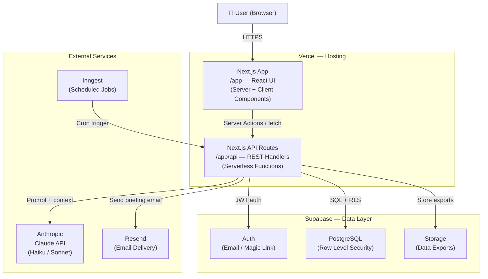
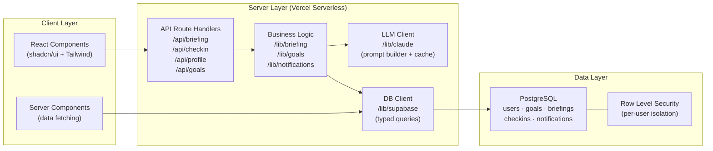
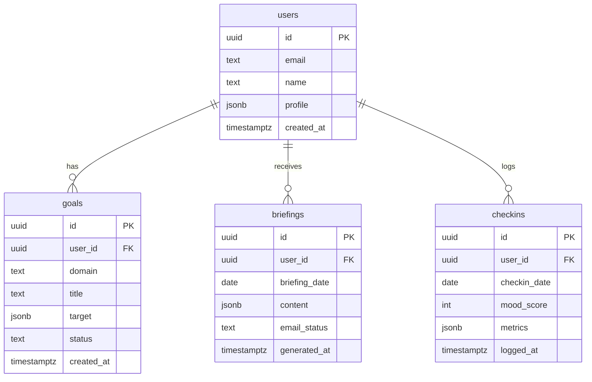
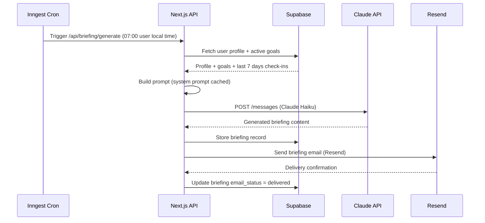
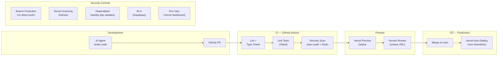

# LifePilot — Architecture Overview

**Version:** 1.0  
**Date:** 2026-05-14  
**Scope:** Phase 1 MVP (Web App)

---

## 1. System Architecture

LifePilot is built as a **fullstack monolith** using Next.js. The frontend, API, and background job triggers live in a single codebase deployed to Vercel. External services (database, LLM, email, job scheduler) are managed SaaS — no self-hosted infrastructure in MVP.

---

## 2. Technology Stack

| Layer | Technology | Purpose |
|---|---|---|
| Frontend | Next.js 15 (App Router) + TypeScript | React UI with server components |
| Styling | Tailwind CSS + shadcn/ui | Component library, rapid UI development |
| Backend | Next.js Route Handlers (serverless) | REST API co-located with frontend |
| Database | Supabase — PostgreSQL | Persistent storage with Row Level Security |
| Auth | Supabase Auth | Email/password, magic link, JWT sessions |
| LLM | Anthropic Claude API | Daily briefing generation and coaching |
| Email | Resend | Transactional email (briefings, nudges) |
| Background Jobs | Inngest | Scheduled briefing generation with retries |
| File Storage | Supabase Storage | User data exports |
| Hosting | Vercel | Serverless deployment, preview environments |

---

## 3. Application Layers

---

## 4. Database Schema (Core Tables)

---

## 5. Daily Briefing Flow

The core agent loop — runs once per day per active user.

---

## 6. DevSecOps Pipeline

**Security controls in place:**

| Control | Tool | What it prevents |
|---|---|---|
| Branch protection | GitHub | Direct pushes to `main`; all changes via PR |
| Secret scanning | GitHub | Accidental API key commits |
| Dependency scanning | Dependabot | Known CVEs in npm packages |
| Security audit | npm audit + Snyk | Vulnerable dependencies in CI |
| Row Level Security | Supabase | Users accessing other users' data |
| Environment secrets | Vercel dashboard | Secrets never in source code |
| TLS everywhere | Vercel (automatic) | Data in transit interception |

---

## 7. Environments

| Environment | Trigger | URL | Purpose |
|---|---|---|---|
| Preview | Every PR | `*.vercel.app` | Test features before merge |
| Production | Merge to `main` | `lifepilot.app` | Live application |

Preview environments are ephemeral — created on PR open, destroyed on merge or close. Each preview has a unique URL and shares the Supabase dev project.

---

## 8. Cost Profile (MVP — 0 to 50 users)

| Service | Tier | Monthly cost |
|---|---|---|
| Vercel | Hobby (free) | $0 |
| Supabase | Free (500MB, 2 projects) | $0 |
| Inngest | Free (50k steps/month) | $0 |
| Resend | Free (3,000 emails/month) | $0 |
| Claude Haiku API | Pay-per-use (~50 briefings/day) | ~$1–3 |
| Domain | Namecheap / Cloudflare | ~$1 |
| **Total** | | **~$2–5/month** |

**LLM cost control:**
- System prompt cached via Anthropic prompt caching (90% input token cost reduction on cached portion)
- Claude Haiku used for all routine briefings
- Hard spend alert set at $10/month in Anthropic console
- Claude Sonnet reserved for Phase 2 cross-domain reasoning

---

## 9. Key Architectural Decisions

| Decision | Choice | Rationale |
|---|---|---|
| Monolith vs microservices | Monolith (Next.js) | Solo AI-assisted build; no ops overhead; fastest to iterate |
| Separate backend vs co-located API | Co-located (Next.js API routes) | One deployment, one codebase, simpler for AI agents to reason about |
| Self-hosted DB vs managed | Managed (Supabase) | Zero ops, built-in auth + RLS, free tier sufficient for MVP |
| Custom job queue vs managed | Managed (Inngest) | Visual dashboard, retries, no Redis/queue infra to manage |
| REST vs GraphQL | REST | Simpler, sufficient for MVP data needs, better AI code generation |
| CSS framework | Tailwind + shadcn/ui | Best AI code generation support; accessible components out of the box |
